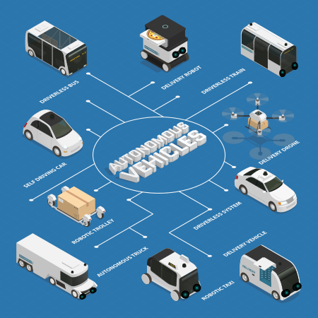
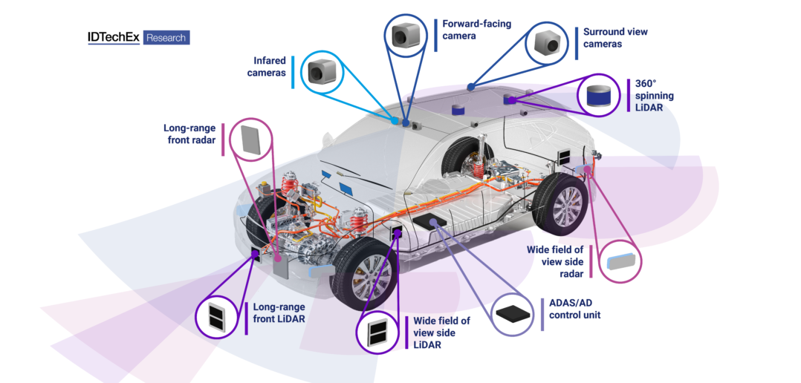

# OpenSDC Starter Kit

- **Figure 1:** Autonomous Vehicles Diagram

- **Figure 2:** Autonomous Vehicle Sensor Suite

Docker and Kubernetes for Self-Driving Cars Interaction with Unity3D Simulation 

Build Docker Images using Docker Bake.

Deploy Docker Images as Docker Containers by two approaches: docker commands and the other approach is kubernetes.

## Build OpenSDC Docker Images with Docker Bake

~~~bash
pushd ~/src/OpenSDC-Starter-Kit

# Builds OpenSDC Backend Docker Image, other images
python scripts/build_image/build_open_sdc_docker_images.py

popd
~~~

## Docker Container Deployment

## Deploy OpenSDC Docker Container with Docker

~~~bash
pushd ~/src/OpenSDC-Starter-Kit/

python scripts/deploy/launch_open_sdc_server.py

popd
~~~

## Deploy OpenSDC Docker Container with Kubernetes

Coming soon...
